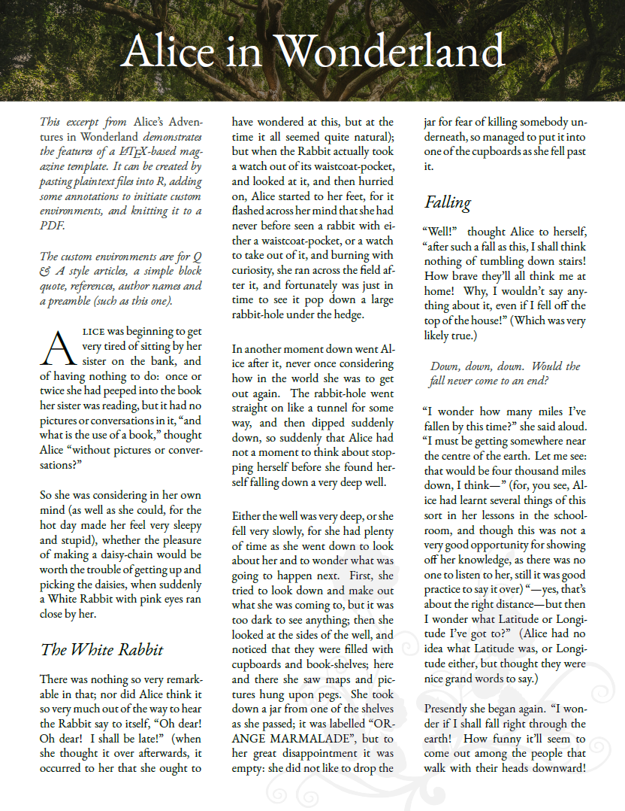

About the Project
================

This repository contains LaTeX code to create a beautifully typeset
magazine. The Magazine-preamble.tex file contains custom environments
for Question-and-Answer articles, author names, a preamble, and quotes.

## How to use

Step 1: Click on the “Code” button and download a zip folder containing
this repository. If you have a GitHub account you could also click on
the “Use This Template” button to make your own repository and then
clone it to your computer. Open the `magazine-latex-template.Rproj`
file. This will open an R project within R Studio. Ensure that you have
a LaTeX distribution (for example, the TinyTeX package will be fine).

Step 2: Read the [Sample Magazine](Magazine/Example-Full-Magazine.pdf)
to see an example of what a final magazine could look like.

Step 3: Read the [Author
Guide](Magazine/Author-Guide-for-Magazine-Formatting.pdf) found within
the Magazine/ folder to see what commands and environments are
available.

Step 4: See the folder `Sample-article-submission` to see examples of
what your text document and images should look like.

Step 5: You can also experiment with the files in the `Magazine/`
folder. There is an empty file to get you started, and an example of one
article.

Step 6. Create a plain-text `.txt` file with the content of your
article, and save it to the `Submissions/` folder.

Step 7. Create any images and save them as `.jpg` files in the `Images/`
folder.

Step 8. Model the file after the
[Example-Full-Magazine.Rmd](Magazine/Example-Full-Magazine.Rmd) file.

Step 9. Knit it to a PDF when you are done and tweak it as needed!

